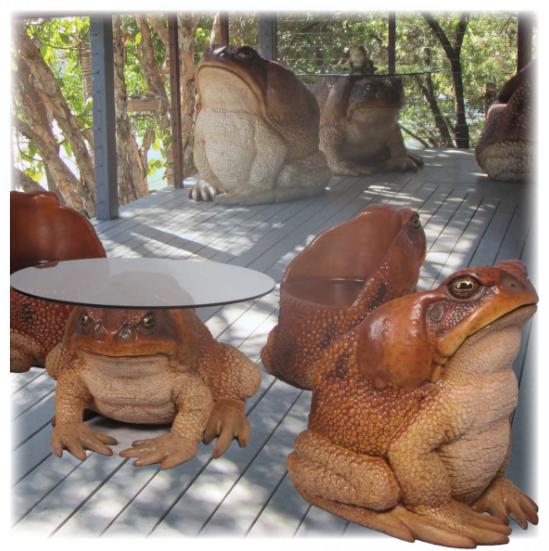

  

<h1 align="center" style="margin-top: -10px"> Wart </h1>

   A text adventure game framework, written in Python.

### Intentions
Work in progress! And mostly just for fun. The idea is that Wart is a framework for authoring -- getting your narrative and player input rolling. The front end of your text adventure game could be built on top of it, using other tools. Contributions are welcome so long as they make sense and do not bloat the project. See philosophy, CONTRIBUTING.md, and ROADMAP.md for more.

### Philosophy
- Light
- Flexible
- Sandbox-like design
- Complexity from simplicity

### Getting Started
Only Python is required. Wart uses only native libraries and modules.
